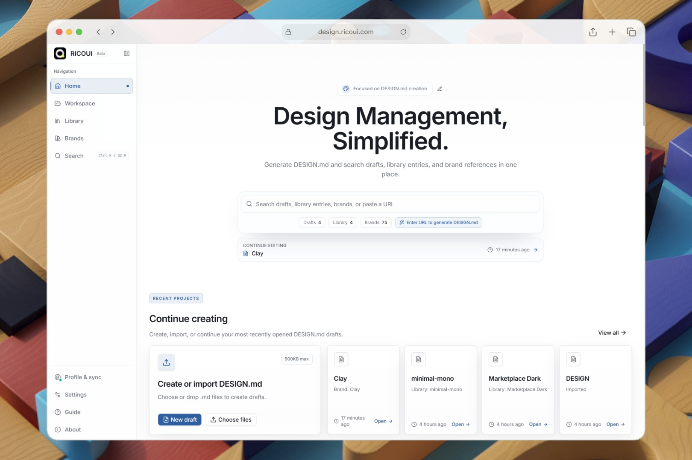
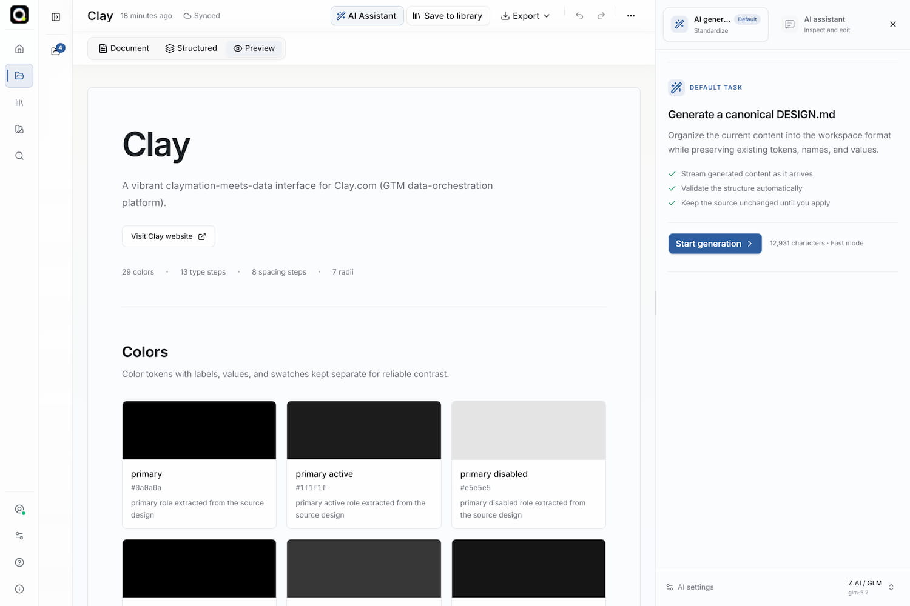
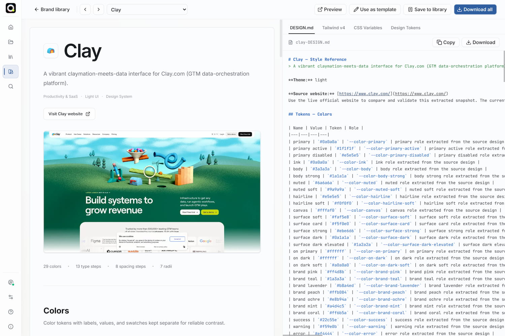
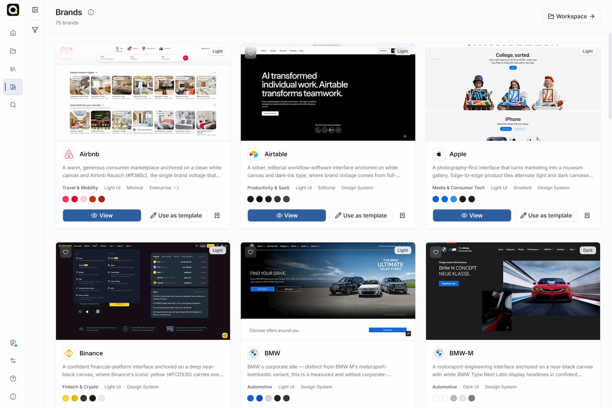

# RICOUI DESIGN

[简体中文](./README.zh-CN.md) · [日本語](./README.ja.md)

RICOUI DESIGN is a local-first design-system workspace built around `DESIGN.md`.



It keeps a readable, versionable Markdown document as the single source of truth, helping designers and developers create, edit, inspect, preview, organize and deliver reusable design specifications.

You can work entirely in the browser without an account. Supabase sign-in and
sync, private delivery versions, user-provided AI providers, Google OAuth,
CAPTCHA and GA4 are optional: enable only the services your deployment needs.

## Project links

| Resource               | Address                                                                          |
| ---------------------- | -------------------------------------------------------------------------------- |
| Website                | <https://design.ricoui.com/>                                                     |
| Open-source repository | [github.com/ricocc/ricoui-design-md](https://github.com/ricocc/ricoui-design-md) |
| Repository name        | `ricoui-design-md`                                                               |

## Who it is for

- Designers and frontend developers who want to document colors, typography,
  spacing, components and implementation constraints in maintainable
  `DESIGN.md` files.
- Individuals and small teams that need stable DTCG tokens, CSS and Tailwind
  themes generated from one specification.
- Maintainers who want private cross-device sync for their own instance while
  keeping a local-first workflow.
- Open-source contributors who want to learn from, extend or contribute to a
  `DESIGN.md` workflow.

This project is currently in Beta. Cloud features require a real Supabase and
Vercel acceptance pass by the deployment owner; they are not a permanent backup
or a formal SLA service.

## Screenshots

<p align="center">

  
    
</p>
<p align="center">
  
</p>

## Core capabilities

### Author, import and preview

- Start a blank draft or import multiple `.md` files at once; each imported
  file may be up to 500 KiB.
- Move between source, reading, structured and preview views. Source remains
  the only source of truth, and unknown Markdown is preserved.
- Edit recognized tokens with structured controls while checking colors,
  typography, layout and component semantics in the preview.
- Local drafts are saved automatically in browser IndexedDB and survive a
  refresh. Export a backup before clearing site data.

### AI assistance without document takeover

- Use your own OpenAI-compatible provider and API key to generate a reviewable
  `DESIGN.md` draft from a public HTTPS website.
- Ask the AI Assistant to explain, inspect, repair, normalize or transform a
  design specification.
- Every AI request that may alter source first presents a complete diff. A user
  must explicitly apply the revision; AI never silently overwrites `DESIGN.md`.
- Provider profiles and API keys stay in the current browser only. They are
  never synchronized to Supabase or held by this application.

### Library, Brand references and delivery

- Save mature specifications to a personal Library with a description, project
  URL, tags and category; use search and bulk management to organize assets.
- Browse read-only Brand references and copy one into your own draft for
  further work. Brand material is for learning and analysis only.
- Export Markdown, DTCG `tokens.json`, CSS variables, Tailwind `theme.css` and
  a local combined ZIP from the same `DESIGN.md` revision.
- After signing in and completing sync, create a deterministic private delivery
  ZIP on the server. Each source keeps its newest two completed versions, which
  can be downloaded, deleted or restored as a new draft from `/releases`.
  Delivery versions never create public share links.

### Brand reference attribution

Built-in Brand-reference material is derived from
[getdesign.md](https://getdesign.md/) and
[VoltAgent/awesome-design-md](https://github.com/VoltAgent/awesome-design-md),
then secondarily parsed by RICOUI for the in-app `DESIGN.md` workflow. It stays
read-only learning and analysis material: this project does not claim ownership
of the original material or that every derived value was confirmed by the
original brand.

### Optional private sync

- Sign in with Supabase Magic Link or Google to switch to a personal cloud
  workspace that is isolated from the signed-out local workspace.
- On first sign-in, choose which local drafts and Library entries to copy to
  the cloud. Copied items receive new IDs; nothing is merged automatically.
- Offline edits first save to an account-isolated device cache, then join the
  sync queue when connectivity returns.
- When two devices change the same source, only that source pauses. Choose to
  keep local changes, load the cloud version or save a new draft.

## Quick start

You need Git, Node.js 22+ and pnpm:

```bash
git clone https://github.com/ricocc/ricoui-design-md.git
cd ricoui-design-md
pnpm install
pnpm dev
```

Open <http://localhost:3000>. No environment variables are required to create,
import, edit, preview, save Library entries or export local files.

Before a production build or contribution, run:

```bash
pnpm typecheck
pnpm lint
pnpm test
pnpm build
```

For system requirements, ports, environment variables and first-run checks, see
the [English quick start](./GUIDE/en/01-quick-start.md).

## Data, privacy and security boundaries

| Location          | Stores                                                                                 | Does not store                                                 |
| ----------------- | -------------------------------------------------------------------------------------- | -------------------------------------------------------------- |
| Browser IndexedDB | Local workspace, account-isolated cloud cache, sync queue, preferences and AI settings | A server-side permanent backup                                 |
| Supabase Postgres | Signed-in Markdown, metadata, preferences, usage and delivery-version metadata         | AI API keys and ZIP file bytes                                 |
| Supabase Storage  | Server-generated private delivery ZIPs                                                 | Ordinary local exports, arbitrary attachments and user AI keys |
| Vercel            | Pages and request-time Route Handler execution                                         | Persistent user-document storage                               |

Without Supabase, the app never uploads drafts automatically. Opening an AI
panel does not read a document either: only the content needed for a request you
explicitly start is sent to the selected provider. Review your provider's data
policy independently.

## Documentation

The complete English documentation is in [`GUIDE/en/`](./GUIDE/en/README.md):

- [01 · Quick start](./GUIDE/en/01-quick-start.md)
- [02 · Complete user tutorial](./GUIDE/en/02-user-tutorial.md)
- [03 · AI configuration](./GUIDE/en/03-ai-configuration.md)
- [04 · Supabase setup](./GUIDE/en/04-supabase-setup.md)
- [05 · Authentication, email and CAPTCHA](./GUIDE/en/05-auth-email-captcha.md)
- [06 · Vercel deployment](./GUIDE/en/06-vercel-deployment.md)
- [07 · Operations and security](./GUIDE/en/07-operations-security.md)
- [08 · Troubleshooting and acceptance](./GUIDE/en/08-troubleshooting-and-acceptance.md)
- [09 · Development and contribution](./GUIDE/en/09-development.md)

Chinese documentation is available in
[`GUIDE/zh-CN/`](./GUIDE/zh-CN/README.md). A Japanese README is available as
[README.ja.md](./README.ja.md); the detailed deployment guide is currently
available in English and Chinese.

## Optional Supabase configuration

Create `.env.local` only when enabling accounts, sync or private delivery
versions:

```dotenv
NEXT_PUBLIC_SUPABASE_URL=https://<project-ref>.supabase.co
NEXT_PUBLIC_SUPABASE_ANON_KEY=sb_publishable_<your-public-key>

# Server only: private delivery versions, signed downloads and complete account deletion
SUPABASE_SECRET_KEY=sb_secret_<your-server-only-key>

# Required only when public registration is open and CAPTCHA is enabled in Supabase
NEXT_PUBLIC_TURNSTILE_SITE_KEY=<your-public-site-key>
```

`NEXT_PUBLIC_SUPABASE_*` values are browser-visible public configuration.
`SUPABASE_SECRET_KEY` must remain in local server variables and Vercel
server-side environment variables. Do not give it a `NEXT_PUBLIC_` prefix,
commit it to Git, or place it in screenshots, logs or issue reports. For
migrations, RLS, Storage and usage limits, read the
[Supabase setup guide](./GUIDE/en/04-supabase-setup.md).

## Recommended deployment

This repository is a standard Next.js App Router application and is designed to
deploy directly to Vercel. Supabase callbacks, URL fetching and the AI streaming
Route Handler (up to 300 seconds) follow the Vercel deployment path.

Docker, Netlify, Cloudflare Workers and other platforms are not currently
adapted or production-validated. After adding a custom domain, update the
Supabase Site URL and Redirect URLs, Google OAuth origins/callbacks and the
Turnstile hostname together.

Follow the [Vercel deployment guide](./GUIDE/en/06-vercel-deployment.md).

## About the author

I am Rico, a web and UI designer who enjoys building useful, creative work. My
experience is in UI/UX design; I currently focus on web design, visual
implementation and hands-on product exploration.

I publish on [Rico's Blog](https://ricoui.com/). You can also follow
[@Rico的设计漫想 on Xiaohongshu](https://www.xiaohongshu.com/user/profile/5f2b6903000000000101f51f)
and [@ricouii on X](https://x.com/ricouii).

Follow the WeChat public account: **Rico的设计漫想**.


Or add my WeChat to say hello:


## 💜 Support the author

If this project helps you, even a small contribution is a meaningful
encouragement. Thank you.


---

⭐ If this project helps you, please consider giving it a Star.
