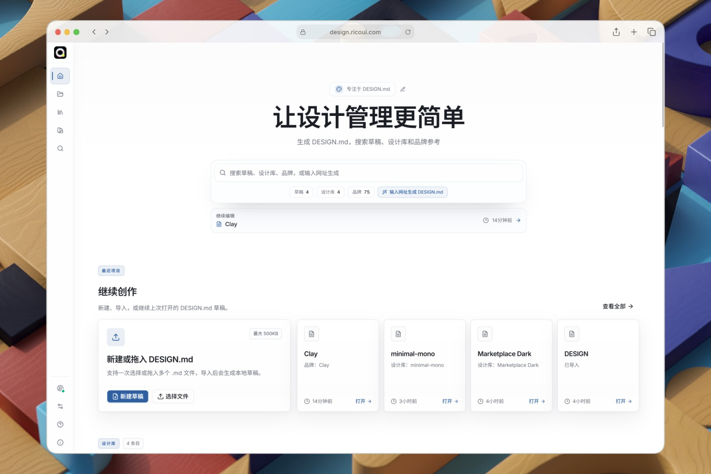
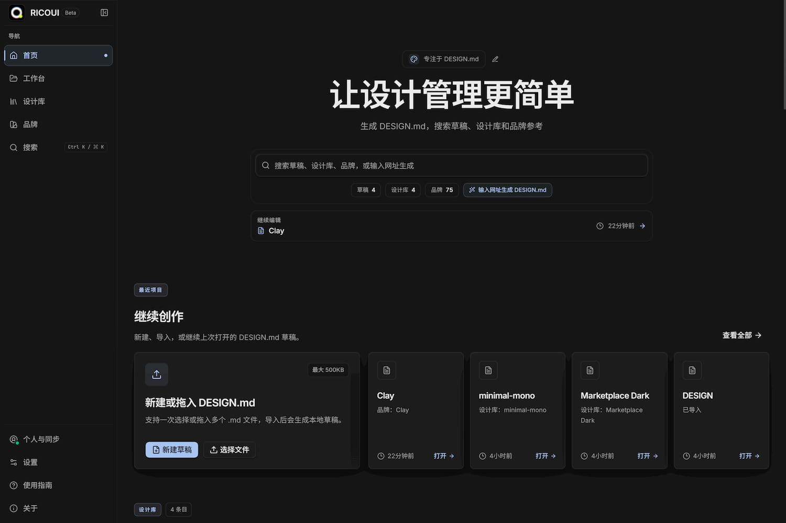
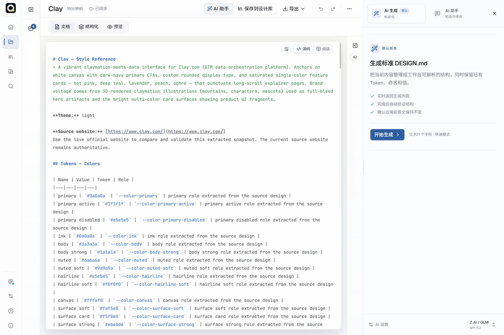
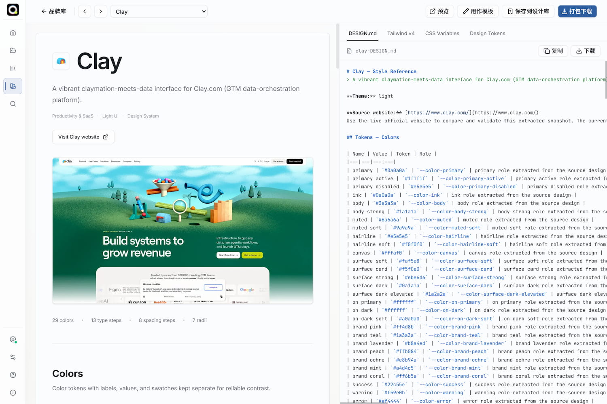
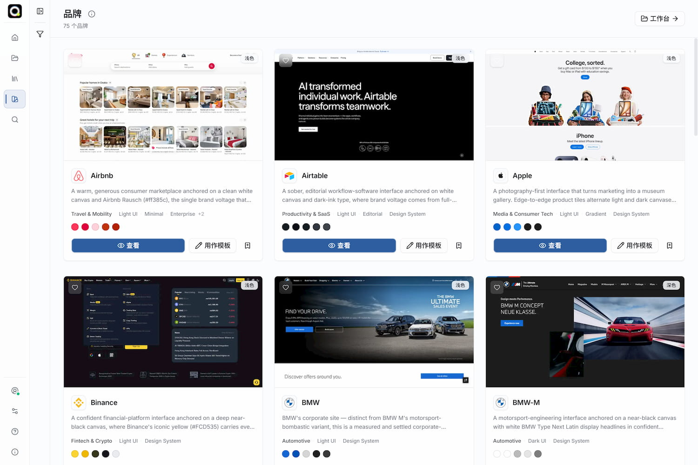

# RICOUI DESIGN

[English README](./README.md) | [日本語](./README.ja.md)

  

RICOUI DESIGN 是一个以 `DESIGN.md` 为核心的本地优先设计系统工作台。它将一份可读、可版本管理的 Markdown 文档作为唯一真源，帮助设计师与开发者创建、编辑、检查、预览、沉淀并交付可复用的设计规范。

应用无需账户即可在浏览器中完整进行本地创作。Supabase 登录与同步、私有交付版本、用户自带 AI Provider、Google OAuth、CAPTCHA 与 GA4 都是可选能力；你可以按需要逐步启用，而不是先
配置一整套云服务。

## 适合谁使用

- 希望将颜色、字体、间距、组件和实现约束整理为可维护 `DESIGN.md` 的设计师与前端开发者。
- 需要从同一份规范稳定导出 DTCG Token、CSS 和 Tailwind theme 的个人或小团队。
- 想在本地优先的前提下，为自己的实例启用跨设备私人同步的维护者。
- 希望学习、二次开发或贡献 `DESIGN.md` 工作流的开源贡献者。

当前版本处于 Beta。云端功能需要部署者自行完成真实 Supabase 与 Vercel 验收；它不应被视为
永久备份或正式 SLA 服务。

## 项目信息

| 项目     | 地址                                                                             |
| -------- | -------------------------------------------------------------------------------- |
| 网站     | <https://design.ricoui.com/>                                                     |
| 开源仓库 | [github.com/ricocc/ricoui-design-md](https://github.com/ricocc/ricoui-design-md) |
| 仓库名   | `ricoui-design-md`                                                               |

## 界面预览

<p align="center">
  
    
</p>
<p align="center">
  
  
</p>

## 核心能力

### 编写、导入与预览

- 新建空白草稿，或一次导入多个 `.md` 文件；单个导入文件最大为 500 KiB。
- 在源码、阅读、结构化和预览四种视图间切换：源码始终是唯一真源，未知 Markdown 原文会保留。
- 对已识别的 Token 使用结构化控件编辑，同时在预览中观察颜色、排版、布局和组件语义。
- 本地草稿自动保存在浏览器 IndexedDB；刷新后可恢复，但清除站点数据前应自行导出备份。

### AI 辅助，但不接管文档

- 使用用户自己配置的 OpenAI-compatible Provider 与 API Key，从公开 HTTPS 网站生成可复核的
  `DESIGN.md` 草稿。
- AI Assistant 可以解释、检查、修复、规范化或按要求调整设计规范。
- 每次可能修改源文档的 AI 请求都会先展示完整差异，必须由用户明确“应用修订”；AI 不会静默
  覆盖 `DESIGN.md`。
- Provider profile 与 API Key 仅保存在当前浏览器，不同步到 Supabase，也不会被应用托管。

### 设计库、品牌参考与交付

- 将成熟规范保存到个人设计库，补充描述、项目 URL、标签与分类，并使用搜索与批量管理整理资产。
- 浏览只读品牌参考，并复制为自己的草稿继续编辑；品牌内容仅作学习和分析参考。
- 从同一版 `DESIGN.md` 导出 Markdown、DTCG `tokens.json`、CSS variables、Tailwind `theme.css`
  和本地组合 ZIP，避免多份真源。
- 登录并完成同步后，可生成服务端确定性的私有交付 ZIP。每个来源保留最新两个完成版本，可在
  `/releases` 下载、删除或恢复为新草稿；不会生成公开分享链接。

### 品牌参考内容来源

内置品牌库的品牌规范内容来源于 [getdesign.md](https://getdesign.md/) 与
[VoltAgent/awesome-design-md](https://github.com/VoltAgent/awesome-design-md)，并经过 RICOUI
的二次解析，以适配应用内的 `DESIGN.md` 工作流。它们始终是只读的学习与分析参考，
不表示本项目拥有原始内容，也不表示所有二次推导的值都已被原始品牌逐项确认。

### 可选私人同步

- 使用 Supabase Magic Link 或 Google 登录，切换到与未登录本地工作区隔离的个人云端工作区。
- 首次登录时，由用户选择哪些本地草稿和设计库条目复制到云端；复制项会生成新 ID，不自动合并。
- 离线编辑先保存在按账户隔离的设备缓存，联网后进入同步队列。
- 两台设备同时修改同一来源时，只暂停该来源并要求用户选择本机覆盖、载入云端或另存新草稿。

## 快速开始

需要 Git、Node.js 22+ 和 pnpm：

```bash
git clone https://github.com/ricocc/ricoui-design-md.git
cd ricoui-design-md
pnpm install
pnpm dev
```

打开 <http://localhost:3000>。此时无需任何环境变量，即可创建、导入、编辑、预览、保存设计库
条目和导出本地文件。

准备生产构建或提交贡献前，运行：

```bash
pnpm typecheck
pnpm lint
pnpm test
pnpm build
```

更完整的系统、端口、环境变量和首次检查说明见[中文快速开始](./GUIDE/zh-CN/01-quick-start.md)。

## 数据、隐私与安全边界

| 位置              | 保存内容                                                  | 不保存内容                          |
| ----------------- | --------------------------------------------------------- | ----------------------------------- |
| 浏览器 IndexedDB  | 本地工作区、按账号隔离的云端缓存、同步队列、偏好、AI 设置 | 服务器端永久备份                    |
| Supabase Postgres | 已登录用户的 Markdown、元数据、偏好、用量与交付版本元数据 | AI API Key、ZIP 文件内容            |
| Supabase Storage  | 服务端生成的私有交付 ZIP                                  | 普通本地导出、任意附件、用户 AI Key |
| Vercel            | 页面和请求期 Route Handler 执行                           | 用户文档的持久化存储                |

未配置 Supabase 时，应用不会自动上传草稿。AI 也不会因打开面板而读取文档；只有在你明确发起
相应请求后，当前任务所需内容才会发送到所选 Provider。请自行评估 Provider 的数据政策。

## 文档导航

完整中文文档位于 [`GUIDE/zh-CN/`](./GUIDE/zh-CN/README.md)：

- [01 · 快速开始](./GUIDE/zh-CN/01-quick-start.md)
- [02 · 完整使用教程](./GUIDE/zh-CN/02-user-tutorial.md)
- [03 · AI 配置](./GUIDE/zh-CN/03-ai-configuration.md)
- [04 · Supabase 配置](./GUIDE/zh-CN/04-supabase-setup.md)
- [05 · 登录、邮件与 CAPTCHA](./GUIDE/zh-CN/05-auth-email-captcha.md)
- [06 · Vercel 部署](./GUIDE/zh-CN/06-vercel-deployment.md)
- [07 · 运维与安全](./GUIDE/zh-CN/07-operations-security.md)
- [08 · 排障与验收](./GUIDE/zh-CN/08-troubleshooting-and-acceptance.md)
- [09 · 开发与贡献](./GUIDE/zh-CN/09-development.md)

英文默认文档位于 [GUIDE/en](./GUIDE/en/README.md)。

## 可选 Supabase 配置

只有在启用账户、同步或私有交付版本时，才创建 `.env.local`：

```dotenv
NEXT_PUBLIC_SUPABASE_URL=https://<project-ref>.supabase.co
NEXT_PUBLIC_SUPABASE_ANON_KEY=sb_publishable_<your-public-key>

# 仅服务端：私有交付版本、签名下载和完整账户删除
SUPABASE_SECRET_KEY=sb_secret_<your-server-only-key>

# 仅在开放公开注册且 Supabase 已启用 CAPTCHA 时需要
NEXT_PUBLIC_TURNSTILE_SITE_KEY=<your-public-site-key>
```

`NEXT_PUBLIC_SUPABASE_*` 是浏览器可见的公开配置。`SUPABASE_SECRET_KEY` 只能留在本地
服务端环境变量和 Vercel 的服务端环境变量中；不得使用 `NEXT_PUBLIC_` 前缀、提交 Git 或出现在
截图、日志与问题单中。详细的 migration、RLS、Storage 和用量配额请阅读
[Supabase 配置指南](./GUIDE/zh-CN/04-supabase-setup.md)。

## 推荐部署方式

当前仓库是标准 Next.js App Router 应用，推荐直接部署到 Vercel。现有 Supabase 回调、网址抓取
和最长 300 秒的 AI 流式 Route Handler 都按 Vercel 路线设计。

Docker、Netlify、Cloudflare Workers 和其他平台目前未完成适配或生产验收。绑定自定义域名后，
务必同步更新 Supabase Site URL 与 Redirect URLs、Google OAuth origin/回调以及 Turnstile
hostname。

完整步骤见[中文 Vercel 部署指南](./GUIDE/zh-CN/06-vercel-deployment.md)。

## 关于作者

我是 Rico，网页/UI设计师，热衷于做些有趣和创意的作品。拥有 UI/UX 设计工作经验，目前专注于网页设计和视觉落地，以及开发项目探索。

我平时在博客 <a href="https://ricoui.com/" target="_blank">Rico's Blog</a> 更新内容。也可以关注我的小红书 [@Rico的设计漫想](https://www.xiaohongshu.com/user/profile/5f2b6903000000000101f51f) 和 X [@ricouii](https://x.com/ricouii).

关注微信公众号：**Rico的设计漫想**


或者添加我的微信，交个朋友


## 💜 支持作者

如果觉得有所帮助的话，一点点支持就可以大大激励创作者的热情，感谢！


---

⭐ 如果这个项目对你有帮助，请给一个 Star！
